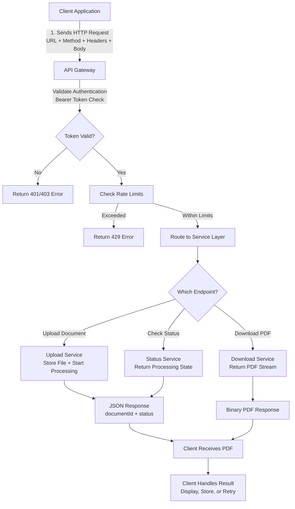

# 📊 API Request Flow Diagram (Mermaid)

This file contains the Mermaid diagram source for the DocuMagic PDF API request flow.  
You can paste this directly into GitHub or any Mermaid‑compatible renderer.

---

## 📘 How to Use This File

- GitHub will automatically render the Mermaid diagram when viewed in the browser.
- VS Code can render it using the **Markdown Preview Mermaid Support** extension.
- Tools like Mermaid Live Editor, Draw.io, or Excalidraw can import this text to generate a visual diagram.

